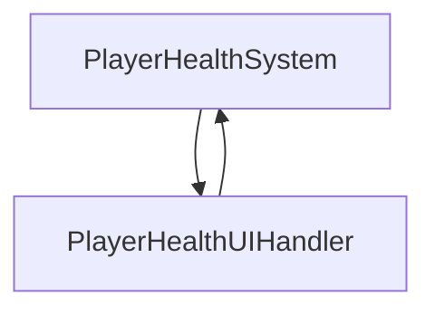
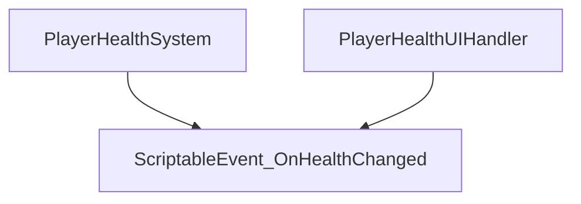

# ScriptableEvents for Unity
Scriptable Object based event management system for reducing dependencies between scripts. Easy to use and easy to customize for your own projects! It's UI components are also [Odin Inspector](https://odininspector.com/) compatible!

## Introduction
In most cases, most of the systems can get dependent to each other to alter or display data. 

With ScriptableEvents you can seperate these dependencies for more realiable code architecture. As shown in the graph below, if PlayerHealthSystem or PlayerHealthUIHandler gets deleted, there won't be any compilation error or no logic change be needed in the other script.

## How To Install

> **Warning**
> 
> Compatible with Unity 2021.3+!

Package registry will be available soon! Until then, feel free to download the git project and put it in your project as a folder!

## How To Use
There are three main categories for ScriptableEvents. Events, Listeners and Variables. But it is not strictly limited to Scriptable Objects! You can define these as BaseEvent, BaseEventListener, GenericVariable for non ScriptableObject use cases for using them as variables inside other scripts without using ScriptableObject types!

There are generic versions of Events, Listeners and Variables for ease of use, but you can directly derive from BaseEvent, BaseEventListener, GenericVariable to customize your code for you own use case!

### Events

Events are used for firing events to listeners. Generic versions are for ease of use. They can be created and customized as need with example showed below.
```csharp
using MSS.ScriptableEvents.Events;

[CreateAssetMenu(fileName = "File name here!", menuName = "Custom Menu Path here!")]
public class CustomScriptableEvent : GenericScriptableEvent<CustomData> { }
```


It is as easy as this to create a custom scriptable event!

There are editor only  only settings and actions for testing and triggering events from editor too!

For creating events to use in other scripts without using scriptable objects, you can create them as such.
```csharp
using MSS.ScriptableEvents.Events;

[System.Serializable]
public class CustomEvent : BaseEvent<CustomData> { }
```
You can also use the created custom events inside of your mono behaviour for more customization! Events can be serialized for editor time data manipulation. With this you can seperate your scriptable events from code defined ones for each use case.
```csharp
public class CustomMonoBehaviour : MonoBehaviour
{
	[SerializeField]
	CustomEvent _customEvent;
}
```


For non generic use cases and if you want to make it more personalized, or to make it have more specialized functions or use cases, you can directly inherit from the BaseScriptableEvent class!

```csharp
using MSS.ScriptableEvents.Events;
using UnityEngine;
  
[CreateAssetMenu(fileName = "File name here!", menuName = "Custom Menu Path here!")]
public class CustomScriptableEvent : BaseScriptableEvent<CustomData>
{
	[SerializeField]
	protected CustomEvent customEvent;
	public override IEventData<CustomData> EventData => customEvent;
	public override IEventLogic<CustomData> EventLogic => customEvent;
	public override IEventInvoker<CustomData> EventInvoker => customEvent;
}
```
There are also options for creating custom void events! 
```csharp
using MSS.ScriptableEvents.Events;

[CreateAssetMenu(fileName = "File name here!", menuName = "Custom Menu Path here!")]
public class CustomVoidEvent : BaseScriptableEvent
{
	[SerializeField]
	VoidEvent  _voidEvent  =  new();
	public override IEventData EventData => _voidEvent;
	public override IEventLogic EventLogic => _voidEvent;
	public override IEventInvoker EventInvoker => _voidEvent;
}
```
There are predefined events in package for types :
 - BoolEvent
 - FloatEvent
 - GameObjectEvent
 - IntEvent
 - StringEvent
 - VoidEvent

And their scriptable event counterparts : 
 - BoolScriptableEvent
 - FloatScriptableEvent
 - GameObjectScriptableEvent
 - IntScriptableEvent
 - StringScriptableEvent
 - VoidScriptableEvent

### Listeners
Listeners are used for responding when events gets fired. Generic versions are for ease of use. They can be created and customized as need with example showed below.
```csharp
using MSS.ScriptableEvents.Listeners;

[CreateAssetMenu(fileName = "File name here!", menuName = "Custom Menu Path here!")]
public class CustomScriptableEventListener : GenericScriptableEventListener<CustomData> { }
```
It is as easy as this to create a custom scriptable listener!

For creating listeners to use in other scripts without using scriptable objects, you can create them as such.
```csharp
using MSS.ScriptableEvents.Listeners;

[System.Serializable]
public class CustomEventListener : BaseEventListener<CustomData> { }
```


There are editor only settings and actions for testing and triggering listeners from editor too!


There is also activation mode selection for automatically subscribe to given events on the created scriptable event listener! You can make it auto subscribe in play mode, editor mode, or both! So you can use it in editor mode for testing, or even in editor tools!

You can also use the created custom listeners inside of your mono behaviour for more customization! Listeners can be serialized for editor time data manipulation. With this you can seperate your scriptable listeners from code defined ones for each use case.
```csharp
public class CustomMonoBehaviour : MonoBehaviour
{
	[SerializeField]
	CustomEventListener _customEventListener;
}
```


For non generic use cases and if you want to make it more personalized, or to make it have more specialized functions or use cases, you can directly inherit from the BaseScriptableEventListener class!

```csharp
using MSS.ScriptableEvents.Listeners;
using UnityEngine;
  
[CreateAssetMenu(fileName = "File name here!", menuName = "Custom Menu Path here!")]
public class CustomScriptableEventListener : BaseScriptableEventListener<CustomData>
{
	[SerializeField]
	protected CustomEventListener customEventListener;
	public override IEventListenerLogic<CustomData> OnInvokedLogic => customEventListener;
	public override IEventListenerData<CustomData> OnInvokedData => customEventListener;
	public override IEventListenerInvoker<CustomData> OnInvokedActions => customEventListener;
}
```
There are also options for creating custom void events! 
```csharp
using MSS.ScriptableEvents.Listeners;

[CreateAssetMenu(fileName = "File name here!", menuName = "Custom Menu Path here!")]
public class CustomVoidEvent : BaseScriptableEvent
{
	[SerializeField]
	VoidEvent _voidEvent = new();
	public override IEventData EventData => _voidEvent;
	public override IEventLogic EventLogic => _voidEvent;
	public override IEventInvoker EventInvoker => _voidEvent;
}
```
Listeners are pretty similar to Events for their complexity but wait!


There are MonoBehaviour listeners for splitting code defined events from classes for more dependency reduction! You can create your own mono listener like this:

```csharp
using MSS.ScriptableEvents.Listeners;

public class CustomMonoScriptableEventListener : GenericMonoScriptableEventListener<CustomData> { }
```
Easy as that!

There are predefined listeners in package for types :
 - BoolEventListener
 - FloatEventListener
 - GameObjectEventListener
 - IntEventListener
 - StringEventListener
 - VoidEventListener

And their scriptable listener counterparts : 
 - BoolScriptableEventListener
 - FloatScriptableEventListener
 - GameObjectScriptableEventListener
 - IntScriptableEventListener
 - StringScriptableEventListener
 - VoidScriptableEventListener

There are event mono listener counterparts too :
 - BoolMonoScriptableEventListener
 - FloatMonoScriptableEventListener
 - GameObjectMonoScriptableEventListener
 - IntMonoScriptableEventListener
 - StringMonoScriptableEventListener
 - VoidMonoScriptableEventListener
 
### Variables
Variables have a special use case for automatically fire events when Variable value changes for tracking changes in data with ease!
Creating a custom variable is easy as this
```csharp
using MSS.ScriptableEvents.Variables;

[System.Serializable]
public class CustomScriptableVariable : GenericScriptableVariable<CustomData> { }
```


Thats it! You can reference the custom variable from any script to change its value!

As with events and listeners, you can also create your own GenericVariable for using it only in code without using Scriptable Objects!

```csharp
using MSS.ScriptableEvents.Variables;

[System.Serializable]
public class CustomVariable : GenericVariable<CustomData> { }
```


There are predefined variables in package for types :

 - BoolScriptableVariable
 - FloatScriptableVariable
 - IntScriptableVariable
 - StringScriptableVariable
## Examples

Will be coming soon!

## Acknowledgments

 - https://github.com/icaro56/simple-atoms-so for inspring this project. 
 - And for much more complete implementation please visit https://github.com/unity-atoms/unity-atoms Unity Atoms project.


